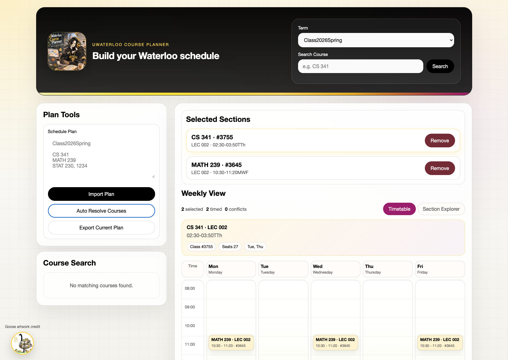

# uw-course

`uw-course` is a browser-based University of Waterloo course planner built on top of the live MongoDB course database.



The project no longer uses the old TUI or PDF export flow. The current app is a Flask web interface with:

- term-aware course search
- section browsing with course descriptions and prerequisites
- weekly timetable view
- plan import/export
- auto-resolution for course-only plans such as `CS 341`

## Install

```bash
pip install uw-course
```

For local development in this repository:

```bash
pip install -e .
```

## Run

Start the web app with either entrypoint:

```bash
uw-course
```

or

```bash
python -m uw_course
```

By default the server runs at [http://127.0.0.1:8120](http://127.0.0.1:8120).

Optional environment variables:

- `UW_COURSE_HOST`
- `UW_COURSE_PORT`
- `UW_COURSE_DEBUG`
- `MONGODB_URI`

## Plan Format

The planner accepts plain text in this format:

```txt
Class2026Winter

CS 341
MATH 239
STAT 230, 1234
```

Rules:

- the first line is the term collection name
- `COURSE CODE` means "auto-resolve a section for this course"
- `COURSE CODE, CLASS_ID` means "lock this exact section"

## Web API

The web app exposes JSON endpoints:

- `GET /api/terms`
- `GET /api/courses?term=Class2026Spring&q=CS%20341`
- `GET /api/courses/<course_code>?term=Class2026Spring`
- `POST /api/schedule`
- `POST /api/plan/parse`
- `POST /api/plan/export`
- `POST /api/plan/resolve`

## Notes

- MongoDB data is read directly from the configured collections.
- `Class2026Winter` and similar term names must match the real collection names exactly.
- If a course cannot be auto-resolved, the backend returns the unresolved reason.

## License

See [LICENSE](LICENSE).
